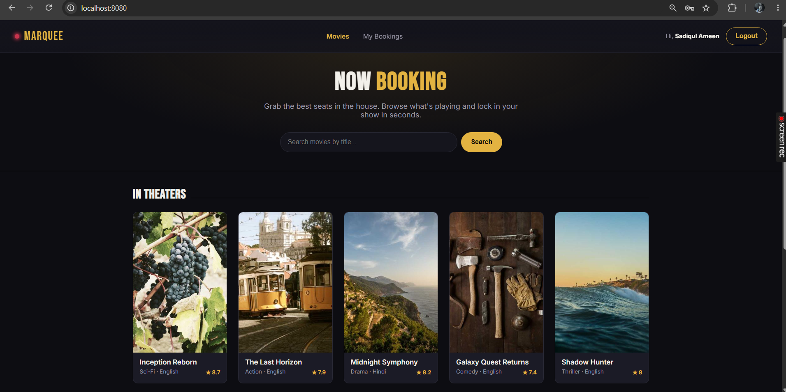
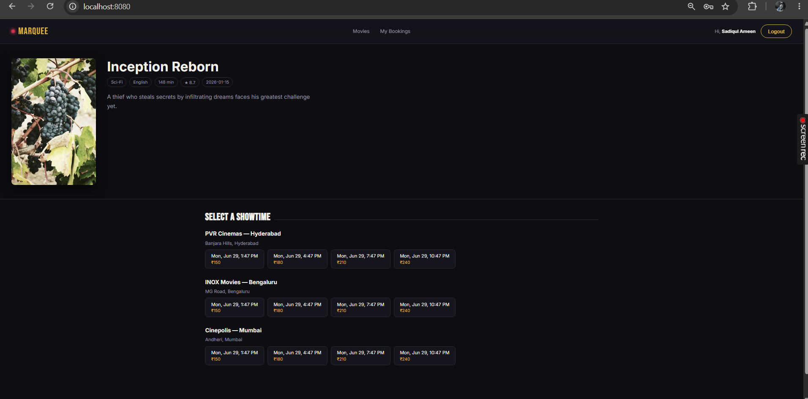
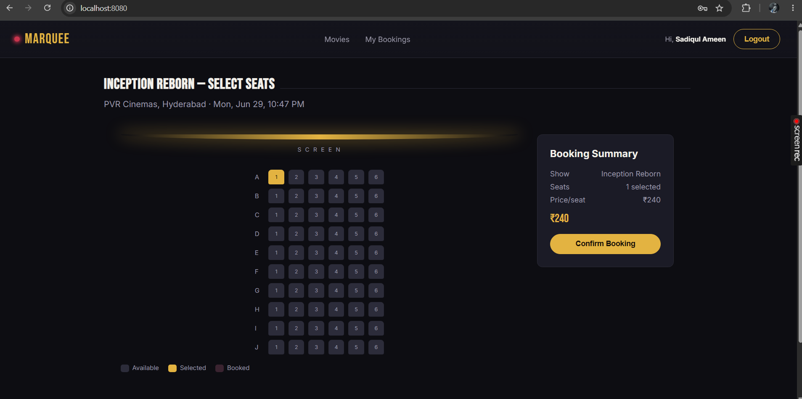
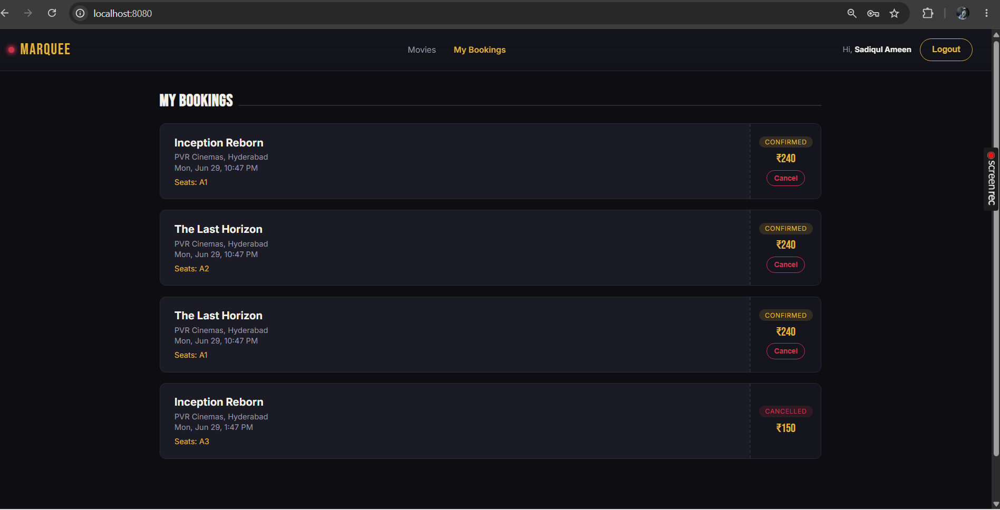

# Marquee — Movie Ticket Booking System

A full-stack movie ticket booking application built with **Spring Boot 3** (Java 17), **Spring Data JPA**, **Spring Security + JWT**, an embedded **H2** database, and a **vanilla HTML/CSS/JS** single-page frontend served directly from Spring Boot's static resources (no separate frontend build step needed).


# Screenshots

## Home Page



## Movie Details



## Seat Selection



## Booking Success



## Features

- Browse movies, search by title, view showtimes grouped by theater
- Interactive cinema-style seat map (10 rows × 6 seats) with live availability
- JWT-based signup/login, seat locking & booking, "My Bookings" with cancellation
- Admin panel (role-protected) to manage Movies, Theaters, and Shows
- Auto-seeded demo data (6 movies, 3 theaters, dozens of shows) + a default admin account

## Tech Stack

| Layer | Tech |
|---|---|
| Backend | Spring Boot 3.2, Spring Web, Spring Data JPA, Spring Security |
| Auth | JWT (jjwt) + BCrypt password hashing |
| Database | H2 (in-memory, auto-seeded) — swap to MySQL/Postgres by editing `application.properties` |
| Frontend | Vanilla HTML/CSS/JS SPA (no framework/build step), served from `src/main/resources/static` |

## Project Structure

```
movie-booking/
├── pom.xml
└── src/main/
    ├── java/com/movieapp/
    │   ├── MovieBookingApplication.java
    │   ├── model/        (Movie, Theater, Show, Seat, Booking, User)
    │   ├── repository/   (Spring Data JPA repositories)
    │   ├── service/      (business logic)
    │   ├── controller/   (REST controllers)
    │   ├── dto/          (request/response payloads)
    │   ├── security/     (JWT filter, UserDetails, JwtUtils)
    │   └── config/       (SecurityConfig, DataSeeder, GlobalExceptionHandler)
    └── resources/
        ├── application.properties
        └── static/        (index.html, css/style.css, js/app.js)
```

## Running Locally

```bash
mvn spring-boot:run
```

Then open **http://localhost:8080** in your browser.

- H2 console (optional, for inspecting data): http://localhost:8080/h2-console
  - JDBC URL: `jdbc:h2:mem:moviedb`, user `sa`, no password
- Default admin login: **username:** `admin` / **password:** `admin123`
- Sign up as a new user to book tickets as a customer.

## Key REST Endpoints

| Method | Endpoint | Auth | Description |
|---|---|---|---|
| POST | `/api/auth/signup` | Public | Register a new customer |
| POST | `/api/auth/login` | Public | Login, returns JWT |
| GET | `/api/movies` | Public | List all movies |
| GET | `/api/movies/search?title=` | Public | Search movies |
| GET | `/api/shows/movie/{id}` | Public | Shows for a movie |
| GET | `/api/seats/show/{id}` | Public | Seat map for a show |
| POST | `/api/bookings` | User | Book selected seats |
| GET | `/api/bookings/my` | User | Your booking history |
| DELETE | `/api/bookings/{id}` | User | Cancel a booking |
| POST | `/api/movies` `/api/theaters` `/api/shows` | Admin | Manage catalog |

## Notable Design Decisions

- **Seat locking is enforced at booking time** inside a `synchronized` + `@Transactional` service method to avoid double-booking race conditions (a real system would use optimistic locking/`@Version` or a Redis-based lock for horizontal scaling — see interview Q&A below).
- **JWT is stateless**: no server-side session; the token carries username/role and is validated on every request via a custom `OncePerRequestFilter`.
- **DTOs decouple the API contract from JPA entities** (e.g., `ShowRequest` takes `movieId`/`theaterId` rather than nested entities, avoiding transient-entity persistence pitfalls).
